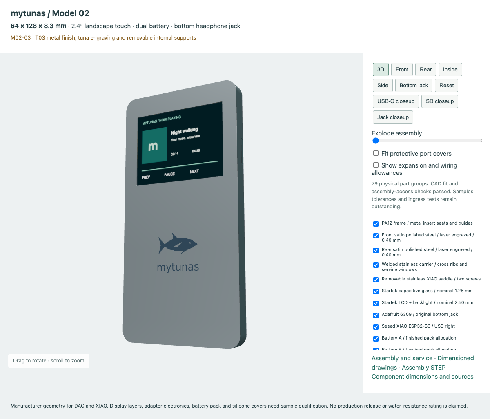
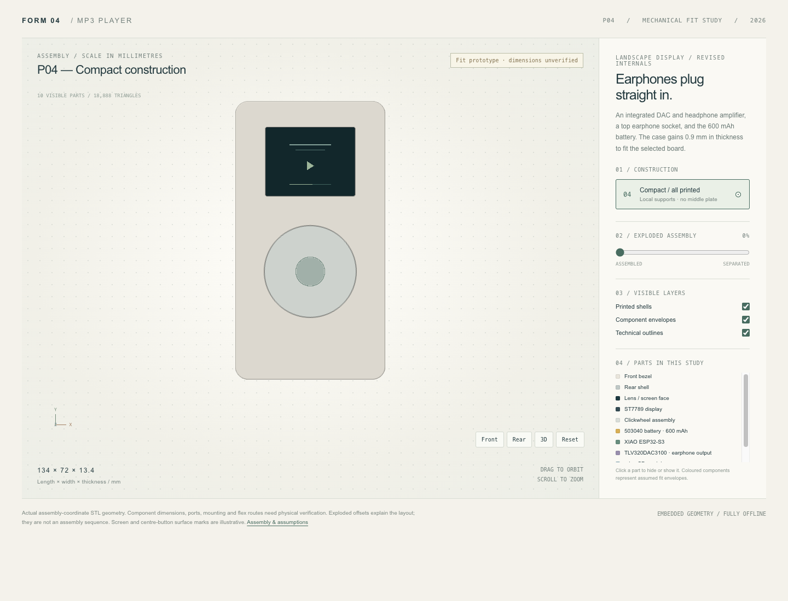
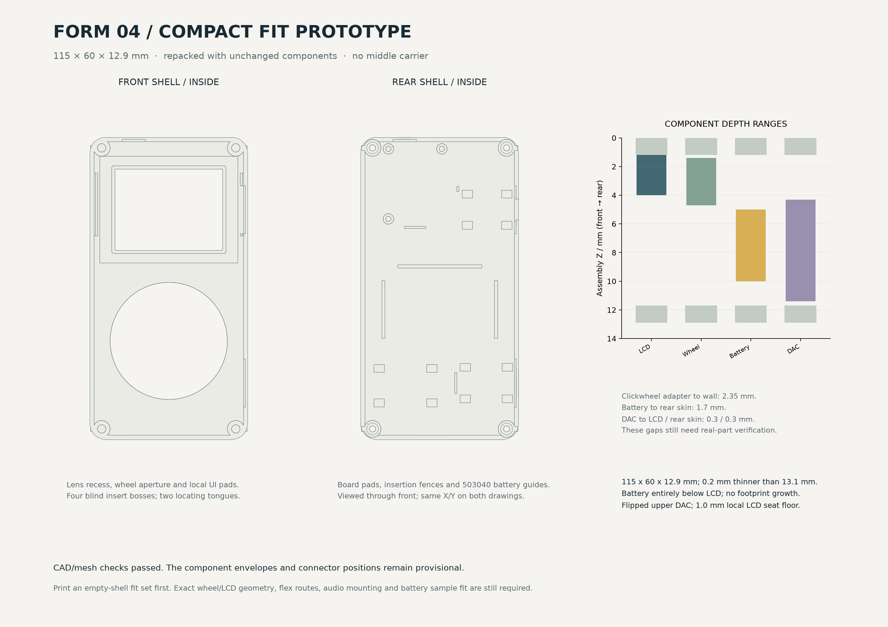
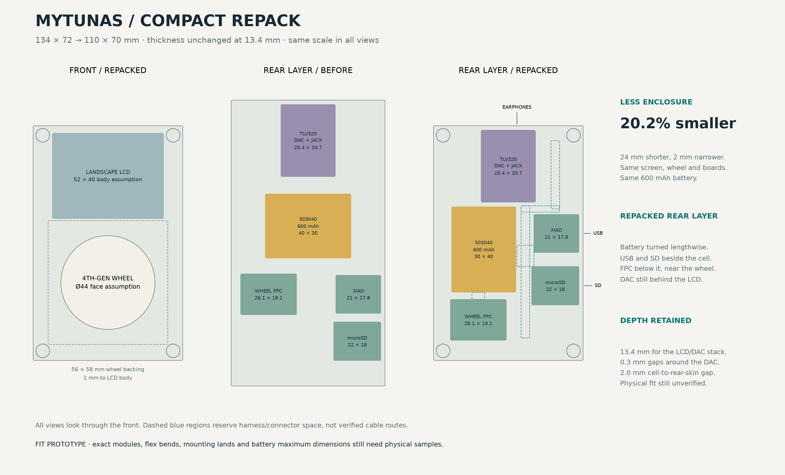

# mytunas — MP3 Player Enclosure / FORM 04

> *I got tired of renting my music.*

**Current Model 02: [mytunas touchscreen](touchscreen_02/README.md)** —
**64 × 128 × 8.3 mm**, a 2.4-inch landscape Startek screen, two battery envelopes
in an L arrangement, and the intact Adafruit board with its original jack facing
the bottom. M02-03 includes the T03 metal finish with engraved steel faces, a welded internal
carrier, metal threaded inserts, removable board supports and port closeups.
CAD fit and assembly-access checks pass; component samples, electronics and
physical production qualification remain outstanding.

**[Open the current Model 02 interactive 3D viewer](https://tunasafa.github.io/mp3-player-enclosure/touchscreen_02/preview.html)**

[](https://tunasafa.github.io/mp3-player-enclosure/touchscreen_02/preview.html)

[Layout notes](touchscreen_02/README.md) · [Assembly validation](touchscreen_02/validation.json) ·
[Assembly STEP](touchscreen_02/designs/M02_03/assembly_NOMINAL.step) ·
[Dimensioned drawings](touchscreen_02/drawings.pdf).
The Pages link serves this revision after deployment. Open `touchscreen_02/preview.html`
locally for immediate offline use. GitHub's code view cannot run the HTML viewer.

The previous **52 × 132 × 10.4 mm T02 is superseded**, and its viewer entry now
forwards to Model 02. [Historical T02 files](touchscreen_01/README.md),
[T03 metal construction reference](touchscreen_metal/README.md), and the
[original side-jack study](touchscreen_metal/studies/side_jack/README.md) remain
available as references. The P04 clickwheel model below is a separate design.

---

## Why this exists

Every month, another €10 disappears into a streaming service that decides what I can listen to, when, and on which devices. Skip limits, offline restrictions, algorithms picking songs for me, entire albums vanishing from catalogs overnight because some licensing deal fell through. And if I ever stop paying? Everything is gone. Years of playlists, gone. Not a single song left.

I used to *own* music. I had files. I had albums. I could play them on whatever I wanted, wherever I wanted, forever. No subscription. No internet required. No corporation standing between me and a song.

So I'm building my own player.

Not a phone app. Not a streaming box. A physical device — with a screen, a clickwheel, a headphone jack, and a microSD card full of music that belongs to me. No accounts, no telemetry, no monthly fee. It plays MP3s. It fits in a pocket. I designed every millimetre of the case myself.

**This is the enclosure for that device.** 115 × 60 × 12.9 mm of 3D-printed refusal to keep paying rent on my own music collection.

---

## Interactive 3D preview

> GitHub can't run the viewer inline, but click the image below — it opens the **live interactive 3D model** directly in your browser. Orbit, zoom, explode the assembly, toggle parts on and off. No install, no signup, nothing to download.

[](https://tunasafa.github.io/mp3-player-enclosure/revision_04/preview.html)

**[🔍 Open the interactive 3D viewer →](https://tunasafa.github.io/mp3-player-enclosure/revision_04/preview.html)**

---

## Design overview



## Internal layout

The new layout keeps the **600 mAh battery entirely below the display**, behind the wheel. The **DAC is flipped 180 degrees about Y at the upper left**, components toward the rear, with its headphone socket at the top. USB sits at the upper right; the wheel adapter and microSD are below the battery. At **115 × 60 × 12.9 mm**, the shell is **0.2 mm thinner than 13.1 mm**, with no footprint increase and no component substitution. A local LCD pocket and a lower wheel seat provide the gain; the original 1.7 mm battery rear allowance is preserved. The rejected 13.8 mm arrangement is no longer the current design.

The rear cap now has DAC mounting-hole locating posts and battery guides matched to the new position. Connector mouths use close-fitting exterior apertures with blind internal reliefs: 5 mm around the jack barrel, 9.4 × 3.7 mm for USB-C and 11.5 × 1.5 mm for the card. These are unsealed openings, not an IP-rated design. The [earlier orientation research](revision_04/studies/dac_orientation/README.md) is historical; [current fit notes](revision_04/README.md) describe this arrangement.

The [offline 3D viewer](revision_04/preview.html) retains its original layout: front, rear, inside and 3D views, an exploded-assembly slider, part visibility, outlines and zoom.



---

## What's inside

| Component | Notes |
|---|---|
| **XIAO ESP32-S3** | Main controller — WiFi/BLE, I2S audio output |
| **ST7789 display** | Landscape orientation, 41 × 31 mm visible window |
| **iPod clickwheel** | Monochrome 4th-gen style, 8-pin FPC adapter |
| **TLV320DAC3100** | Adafruit #6309 — integrated DAC + headphone amplifier |
| **503040 battery** | 600 mAh, 3.7 V protected LiPo (40 × 30 × 5 mm) |
| **microSD module** | Music storage, right-side card slot |

## Enclosure

- **Two printed shells** — front bezel + rear shell, no middle carrier plate
- **Engraved rear cap** — centered waveform/m logo and lowercase mytunas name, 0.3 mm recess
- **Four M2 × 7 mm** heat-set inserts and screws
- **Clear lens** — 43 × 33 × 0.6 mm, laser-cut from clear sheet
- **Top 5 mm circular opening** around the intact DAC's headphone socket
- **Side ports** — USB-C and microSD (right)

## Repository structure

```
revision_04/
├── preview.html           ← Interactive 3D viewer (standalone, offline)
├── parameters.json        ← All dimensions and positions
├── build.py               ← CadQuery model source
├── make_viewer.py         ← Regenerate preview.html
├── make_drawings.py       ← Generate design_overview
├── make_layout.py         ← Generate internal_layout
├── BOM.csv                ← Parts list
├── HARDWARE_NOTES.md      ← Wiring, pinout, adapter details
├── README.md              ← Detailed assembly instructions
├── validation.json        ← CAD checks (watertight, collisions)
├── designs/
│   └── P04_compact/
│       ├── STL/           ← Print-ready STL files
│       └── reference_only/← Assembly-coordinate reference meshes
└── vendor/                ← Third-party CAD attribution
```

## Quick start

### Print the case

1. Download `front_bezel.stl` and `rear_shell.stl` from [`designs/P04_compact/STL/`](revision_04/designs/P04_compact/STL/)
2. Import as **millimetres** at 100% scale
3. Print with PETG or PLA — 0.2 mm layers, 4 perimeters, 7+ solid skin layers
4. The fit coupon is included for testing insert/screw fit before committing

### Rebuild from source

```sh
python3 -m venv .venv
.venv/bin/python -m pip install -r revision_04/requirements.txt
.venv/bin/python revision_04/build.py
.venv/bin/python revision_04/make_viewer.py
.venv/bin/python revision_04/make_drawings.py
```

## Key dimensions

| Measurement | Value |
|---|---|
| Overall | 115 × 60 × 12.9 mm |
| Wall thickness | 1.6 mm |
| Skin thickness | 1.2 mm |
| Corner radius | 6.0 mm |
| Seam gap | 0.2 mm |
| Fastener seat Z | 10.0 mm |

## Status

This is a **fit prototype** — the digital model passes CAD validation (watertight meshes, no assembly collisions, depth clearances), but:

- No physical print has been assembled
- Component dimensions are from seller listings, not measured samples
- Flex cable routing, battery connector polarity, and firmware integration are unverified
- The clickwheel adapter setup is provisional

See [`revision_04/HARDWARE_NOTES.md`](revision_04/HARDWARE_NOTES.md) for detailed wiring and the [`validation.json`](revision_04/validation.json) for the full check report.

## License

This is a personal hardware design project. The Adafruit TLV320DAC3100 vendor CAD is included under its original license terms — see [`revision_04/vendor/README.md`](revision_04/vendor/README.md) for attribution.
