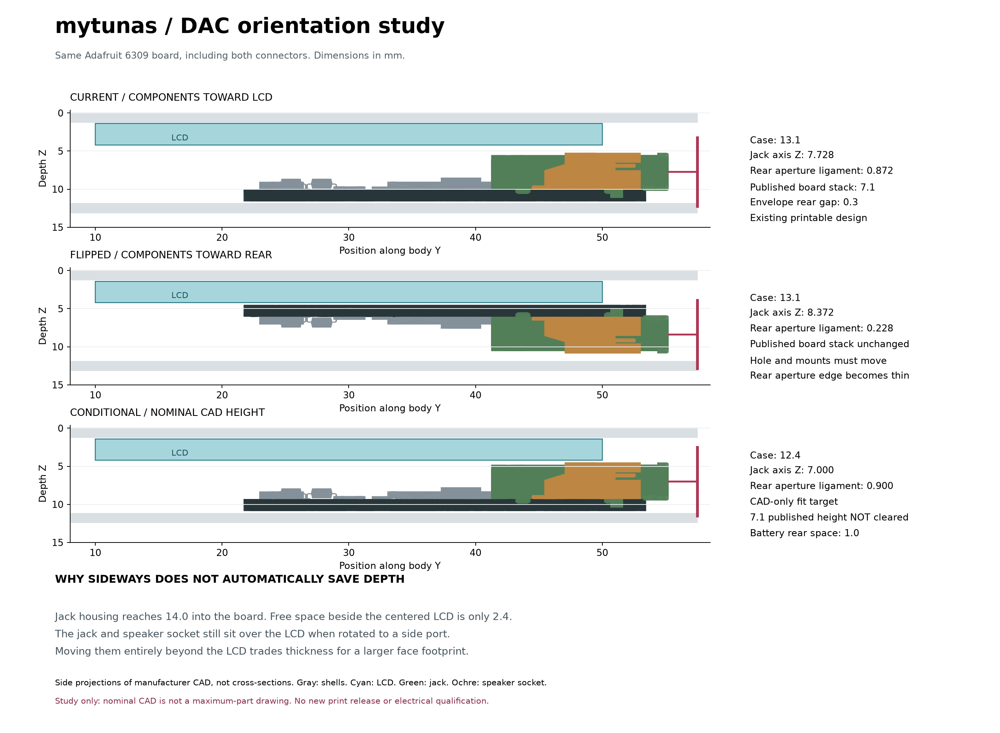

# mytunas: DAC orientation and compact packaging

Research and CAD study, 2026-09-11. All selected modules, the original wheel and the 503040 battery are retained in the updated printable design. Moving the DAC or its jack opening is allowed. The top opening is a result of this comparison, not a fixed requirement.

## Implemented result

| | Previous compact P04 | Updated P04 |
|---|---:|---:|
| Length | 110 mm | 115 mm |
| Width | 70 mm | 60 mm |
| Thickness | 13.4 mm | 13.1 mm |
| Bounding-box volume | 103.18 cm3 | 90.39 cm3 |
| Battery-to-rear-skin allowance | 2.0 mm | 1.7 mm |

This saves **12.4% volume**, with a **10 mm narrower** grip and **0.3 mm less thickness**, at the cost of **5 mm more length**. It is not a large thickness breakthrough. Compared with the original 134 x 72 x 13.4 mm design, volume is down 30.08%.

The card module moves beside the wheel adapter, USB moves to the upper right of the battery, and the cell connector moves above USB. Screws move toward the ends to clear the original wheel and LCD in the narrower body. The LCD seat moves forward 0.3 mm, with 0.7 mm remaining behind the lens and a 0.2 mm bonding allowance. The DAC and rear shell follow that change. The full published DAC envelope remains intact.

The central wiring reserve now passes below the cell guides. It is 2.6 x 4.2 mm in cross-section, narrowing to 1.4 x 4.2 mm near the upper XIAO stop. Wire insulation diameter, bundle shape and bend transitions must be checked; empty-volume clearance is not completed harness routing. The XIAO stop uses a smaller upper contact land, which still needs insertion-force testing. The cell's remaining 1.7 mm is provisional space, not a supplier-qualified expansion allowance.

## What flipping actually changes

The unscaled [Adafruit manufacturer model](https://learn.adafruit.com/adafruit-tlv320dac3100-i2s-dac/downloads) contains a 1.57 mm PCB, a jack reaching about 6.3725 mm above the board datum, and a speaker socket reaching 6.37 mm. The jack housing extends **14 mm along the PCB**. Its 3.5 mm bore is not its outside size. Adafruit publishes **33.7 x 25.4 x 7.1 mm** overall, so the physical planning allocation remains larger than the STEP. [Product dimensions](https://www.adafruit.com/product/6309)

The current depth stack is:

`LCD rear at 4.2 + 0.3 gap + 7.1 DAC + 0.3 gap + 1.2 rear skin = 13.1 mm`

A face flip preserves that stack. In the nominal STEP, it moves empty allocation from one side of the board to the other, which can look like recovered space in a render. It does not establish a smaller maximum component height.

Keeping the same envelope position while flipping moves the socket axis from **X +4.059 / Z 7.728** to **X -4.059 / Z 8.372 mm**. The hole must move with it. With the existing 9 mm plug-access opening, the rear ligament falls from **0.872 to 0.228 mm**. The study uses a provisional 0.8 mm ligament criterion; a rear-facing layout would need approximately 13.673 mm thickness under these assumptions, or a different plug/access design. This is a geometric screening criterion, not a proven material-strength rule.

The current and flipped STEP poses do not intersect the existing shells/components as solids. That alone does not prove fit: the flipped jack misses the existing aperture, and its back-side support/adhesive relationship changes. Neither alternative reference STEP is a printable release.

## Moving the board and jack

The script evaluates **380 rear-layer placements** across four socket directions and both board faces in the updated footprint. It uses separate manufacturer-part bounding boxes, the other component and routing envelopes, and corner-fastener exclusions. Top and left-facing layouts have the same best depth stack; changing to a side port alone does not reduce thickness. The right-side alternatives compete with USB, storage and their wiring.

This is a bounded placement screen. It does not prove that every possible three-dimensional arrangement has been exhausted, and it does not include tilted boards or arbitrary global component permutations. The printable repack separately changes the other boards, connector and fastener locations and passes the full existing CAD collision checks.

A second, **50-case study** moves the other components and front controls toward the bottom while moving the DAC toward the top. This creates a strip where the tall jack and speaker socket can sit beyond the LCD. Its conditional low-profile model adds the entire 0.7275 mm published/STEP discrepancy to each part's component-side height, retaining the 7.1 mm overall height. That is an explicit geometry hypothesis, not manufacturer confirmation of local maxima.

With the 1.7 mm battery reserve retained, this does not make the device thinner: the cell stack becomes the limit. Reducing that reserve to an unqualified 1.0 mm produces a **125 x 60 x 12.4 mm** candidate. It is 0.7 mm thinner but 10 mm longer and **2.9% larger in volume than the updated design**. Mounts, flex routes and shifted front openings would also need redesign. This is documented as a tradeoff, not released as a better enclosure.

There is a more attractive conditional target: **115 x 60 x 12.4 mm**, if the purchased DAC's finished height supports the 6.3725 mm nominal STEP plus the planned assembly allowances. This also leaves only 1.0 mm behind the nominal battery. Neither height is currently verified, so the printable design remains 13.1 mm.

## Lessons from Apple and open hardware

Apple specifies the seventh-generation iPod nano at **76.5 x 39.6 x 5.4 mm**. That demonstrates the result of a different integrated hardware platform; it is not a feasible target inferred for our 7.1 mm breakout and 5 mm cell. [Apple specifications](https://support.apple.com/en-us/112039)

iFixit's original teardown shows a small logic board, a battery behind the display, shaped flex interconnects, and soldered peripheral connections. The useful inference for mytunas is to co-design the enclosure, connector positions and interconnects, use exact component heights, and avoid overlapping the tallest structures. It does not justify removing insulation or reducing a printed wall to an aluminum-case thickness. [Original teardown](https://www.ifixit.com/Teardown/iPod+Nano+7th+Generation+Teardown/10826)

[Tangara](https://cooltech.zone/tangara/) is a particularly relevant open-hardware music player: its authors provide KiCad electronics, enclosure work and assembly documentation. Its architecture uses dedicated power management and an I2S DAC/headphone chain rather than treating a group of breakout boards as an electrically complete player. Our existing GPIO and power constraints still need bench resolution. [Tangara electronic design](https://cooltech.zone/tangara/docs/electronic-design/)

Tangara's authors also publish audio measurements and discuss how headphone load and gain affect distortion and noise. For mytunas, test the assembled player with its intended earphones and representative loads while storage, display and charging operate. A tighter layout is not evidence of better audio. [Tangara audio measurements](https://cooltech.zone/tangara/blog/2024-02-14-audio-quality/)

## Electrical and assembly constraints

- Keep the existing onboard jack connected directly to the headphone driver. Retain the unused speaker socket physically, leave it unconnected and disable the class-D speaker path. Use regulated 3.3 V headphone-only operation, common ground, I2C setup and reset. [Adafruit pinouts](https://learn.adafruit.com/adafruit-tlv320dac3100-i2s-dac/pinouts)
- Keep I2S clock/data routes short with adjacent ground returns. Preserve local supply bypassing and the codec's intended grounding. TI's chip-level guidance calls for close decoupling and deliberate analog/digital ground treatment; it is not a reason to cut the finished breakout's ground plane. [TI datasheet, layout section](https://www.ti.com/lit/ds/symlink/tlv320dac3100.pdf)
- Separate sensitive analog routing from digital and charging-current paths by placement. Do not introduce a ground-plane split across signal returns simply to label one area "analog." [Analog Devices grounding guidance](https://www.analog.com/en/resources/technical-articles/successful-pcb-grounding-with-mixedsignal-chips--follow-the-path-of-least-impedance.html)
- Retain the XIAO's onboard USB routing. Relocating the entire module does not require extending the USB differential pair; a redesigned PCB would need controlled impedance and a continuous reference plane. Core-chip layout recommendations are not automatically requirements to redesign the existing module. [Espressif layout guidance](https://docs.espressif.com/projects/esp-hardware-design-guidelines/en/latest/esp32s3/pcb-layout-design.html)
- Preserve bottom-contact wheel-flex orientation, latch access and a real bend radius. Radius depends on the actual flex thickness, layers and service motion. Fabricator examples cannot certify this unidentified original Apple flex. [JLCPCB flex capabilities](https://jlcpcb.com/capabilities/flex-pcb-capabilities)
- Verify regulator headroom, charge compatibility, peak current and temperature with all peripherals active. Battery discharge capability alone does not establish the XIAO rail budget. [Seeed battery and power documentation](https://wiki.seeedstudio.com/xiao_esp32s3_getting_started/)

## What enables the next reduction

Measure the assembled DAC across the jack, speaker socket, PCB underside and solder joints; identify the exact LCD board and connector; and obtain the finished battery dimensions and expansion/charge requirements. These distinguish a viable 12.4 mm target from a model-only fit. Also measure the selected earphone plug shoulder, flex construction and actual wire bundle.

A custom interconnect PCB or flex can preserve the selected modules while replacing bulky wiring, but its own thickness and connector lands consume space. Replacing breakout PCBs with a custom board carrying the same functional ICs would be a new electrical design, not the same complete modules: it needs a schematic, power and GPIO review, layout, fabrication and bench testing. No PCB was redesigned, no module was substituted or depopulated, and no untested audio or battery performance improvement is claimed here.

## Reproduce

From the repository root, run `.venv/bin/python revision_04/study_dac_orientation.py` after rebuilding the CAD. It produces [results.json](results.json), the [PDF comparison](comparison.pdf), and current/flipped assembly-coordinate STEP references. The report includes input hashes; packaging rejects stale study results. The separate main CAD/browser checks validate the printable design and interactive preview, not the conditional alternatives.
